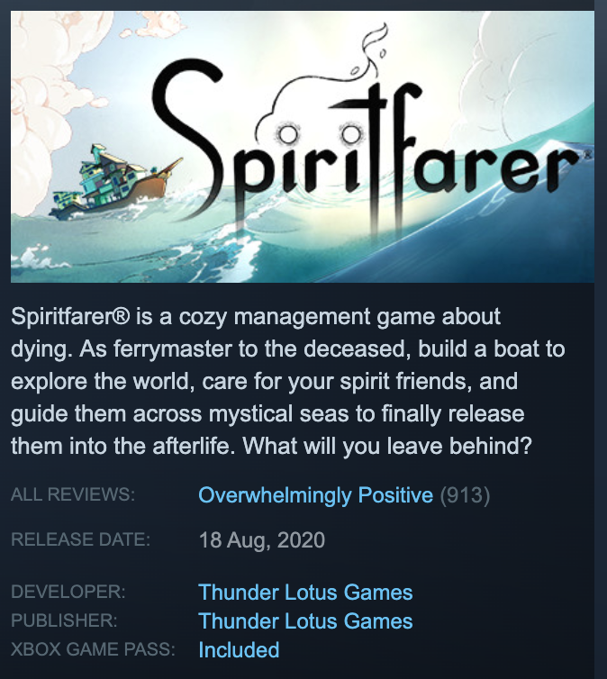

# included-with-xbox-game-pass

A browser extension that adds the mention "included / not included with Xbox Game Pass" on Steam's store page.

- [Add to Chrome](https://chrome.google.com/webstore/detail/included-with-xbox-game-p/acohddgjcjfelbhaodiebiabljoadldk)

## Installation

This repository is divided into sub-packages, all orchestrated with [Lerna](https://lerna.js.org/).
Here's how you can get a local copy running:

1. Clone this repository
2. Install Node.js
3. Run `npm install`
4. Run `CI=true npx lerna bootstrap`
5. Run `npm start`

The code will be compiled automatically when a change is detected.
You can load the unpacked extension in `packages/extension/dist`.

See the packages' readme for more details.

## License

[MIT](LICENSE)
